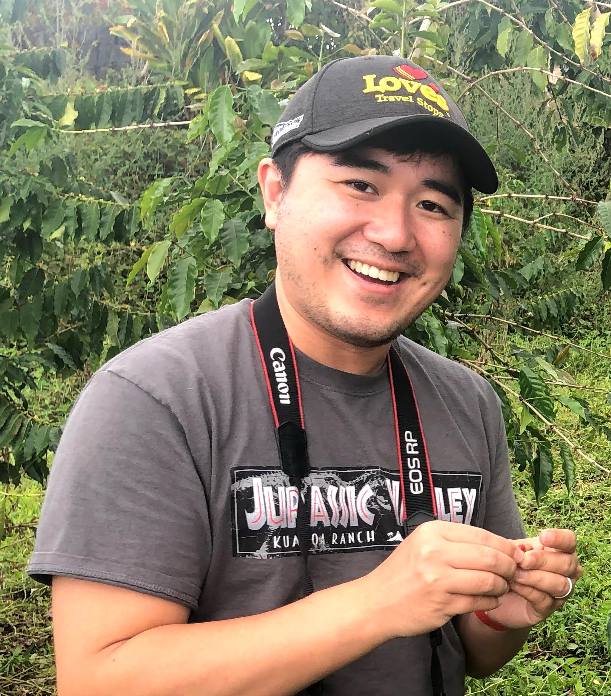

# Capstone 1 - CyVerse FOSS 2021

In Capstone I, we will be working to share data management plans with each other using the website materials. Ultimately, we will make a page for our team describing team members, link to the person’s data management plan, etc.

## Team Members

<h3 style="text-align:center;color:Green;">Austin Rutherford</h3>

    
   

Austin is originally from Georgia and completed his undergraduate work at Indiana University. Before coming to the University of Arizona, he interned for the Bureau of Land Management in Nevada and was a technician for the US Geological Survey in Utah. He is currently a PhD Candidate within the School of Natural Resources and the Environment in the Ecology, Management, and Restoration of Rangelands program. His dissertation work utilizes field-based experiments to investigate the seedling establishment phase of velvet mesquite shrubs in Sonoran Desert grasslands. These findings guide the development of a geospatial model and an interactive decision support tool to assist land managers in southern Arizona to evaluate a site’s susceptibility to shrub encroachment. 

Find more information about Austin's projects at the **[Archer Lab Website](https://cals.arizona.edu/research/archer/exotic.html)**

He is slowly but surely creating a new Data Management Plan (DMP) for an existing project using the [Data Steward Wizard](https://ds-wizard.org/).
The [DMPTool](https://dmptool.org) was used originally for the project proposal, but he is interested in expoloring the differences between the two tools for future projects.

An early draft version of a test DMP using the Data Steward Wizard can be found **[HERE](https://researchers.ds-wizard.org/projects/64a7d204-a248-41de-b481-8da4d557f372).**

During the CyVerse FOSS Spring 2021 workshop, we have covered many helpful tools and concepts including the definitions and importance of Open Science, FAIR data, and Data Management Plans; GitHub for code/script version control and active project collaboration; the various platforms within CyVerse (Data Store, Data Commons, Discovery Environment (DE), and Atmosphere) for doing Open Science and to make our data more FAIR; the utility of virtual machines (e.g., (Atmosphere) and containers (e.g., Docker) for doing reproducible research. At this point in time, I feel most comfortable with GitHub to track scripts and share with collaborators, using the CyVerse DE for performing analyses, and launching a virtual machine. I can readily apply all the aforementioned tools and topics to my current research projects. The greatest barriers to these tools are exposure, new terminology from the Computer Science/Information Technology domains, and feeling comfortable in experimenting with new tools. I've historically been uncomfortable doing anything with the command line in fear of making a grave mistake, but with exposure, I'm becoming much more secure in my abilities to use it in multiple applications. I'm getting more comfortable with Docker containers, but I still get a little hung up on some of the terminology, concepts, and specific flags in building, running, and port forwarding the containers. I'm confident that this will improve with time/experience and has sparked my interest in attending additional CyVerse workshops on containers in the future. 

---

<h3 style="text-align:center;color:Green;">Kangsan Lee</h3>

    

I am a second year phd student in the school of geography. One of my interesting area is wildfire, mainly focusing on forest restoration after fires. I prefer using LiDAR and Landsat-derived fire severity dataset. Interesting study area is Southwestern U.S. around Arizona and New Mexico. I am wondering whether we can visualize fire severity datset on the web through this capstone project. For more information about my research in Arizona Remote Sensing Center, please visit **[ARSC](https://snre.arizona.edu/facilities/arsc).**

---

<h3 style="text-align:center;color:Green;">Ariyan Zarei</h3>

    

Ariyan is a 3rd year PhD student in the department of Computer Science at the University of Arizona. He previously received his B.Sc. in Computer Science from Shahid Beheshti University in Tehran, Iran. He is interested in the applications of Deep Learning and Image Processing in the Medical and Plant Sciences. Ariyan is currently working on the PhytoOracle project and is designing machine learning, computer vision, and statistical models for geo-correction and stitching of high-resolution RGB image data. For more information about Ariyan please visit his **[webpage](http://vision.cs.arizona.edu/ariyanzarei/)**.

During the FOSS sessions, I have learned how to use Github Pages, Containers, Atmosphere Virtual Machines and Cyverse Apps. I can use all these tools to my research right away. Github Pages provides a perfect platform for showcasing my project to the other scientists, Cyverse Apps allow me to share pieces of application that I created with other collaborators and I can use Atmosphere Virtual Machines alongside with containers to test my code in an isolated environment. The greatest barrier to using Containers is that I need to know some networking details such as ports and connections to be able to fully use them in my research. I wish we had convered containers more in depth. 

---

<h3 style="text-align:center;color:Green;">Reza Ehsani</h3>

    
   

Reza is a 2-nd year PhD candidate in Hydrology & Atmospheric Sciences at the University of Arizona with BSc in Civil & Environmental Engineering. Before joining UArizona, he was involved in several World Bank Group projects in Tanzania as a water resources expert. His dissertation work is focused on precipitation retrieval in high latitudes
and cold regions utilizing machine learning & deep learning. His works directly contribute to the improvement of the precipitation products such as NASA GPM IMERG that is important not only for the present weather observations but also for long-term climate analysis, either by itself or through its contribution to the climate products. You can contact Reza at **[LinkedIn.com/in/rehsani/](https://www.linkedin.com/in/rehsani/)**.

---

# FOSS Capstone II Project

### Goal
The goal of our project is to use a virtual machine using Atmosphere to run a script that will:
1. Pull a compressed data folder containing many RGB images from the **[PhytoOracle Project](https://phytooracle.readthedocs.io/en/latest/)'s** CyVerse Data Store
2. De-compress the data
3. Run a Docker container from DockerHub container image to open image metadata

To accomplish this project:
* Create a Data Management Plan for project using the Data Stewardship Wizard
* Use existing FOSS 2021 Team B GitHub repo for version control of script to run on virtual machine 
* Create an additional README to outline purpose of project, but also potential next steps/to dos

**Checkout our project's current [Data Management Plan]().**

**Our FOSS 2021 Team B [GitHub Repo](https://github.com/ariyanzri/Capstone1_Foss).** 

**Project specific README is located within our Capstone1_Foss/[project folder](https://github.com/ariyanzri/Capstone1_Foss/tree/main/project) with our code within
the Capstone1_Foss/[code folder](https://github.com/ariyanzri/Capstone1_Foss/tree/main/code).**

**Specific GitHub page/README for project detail and script documentation can be found [here](project/README.md)**

---
# Thank you for your time!
