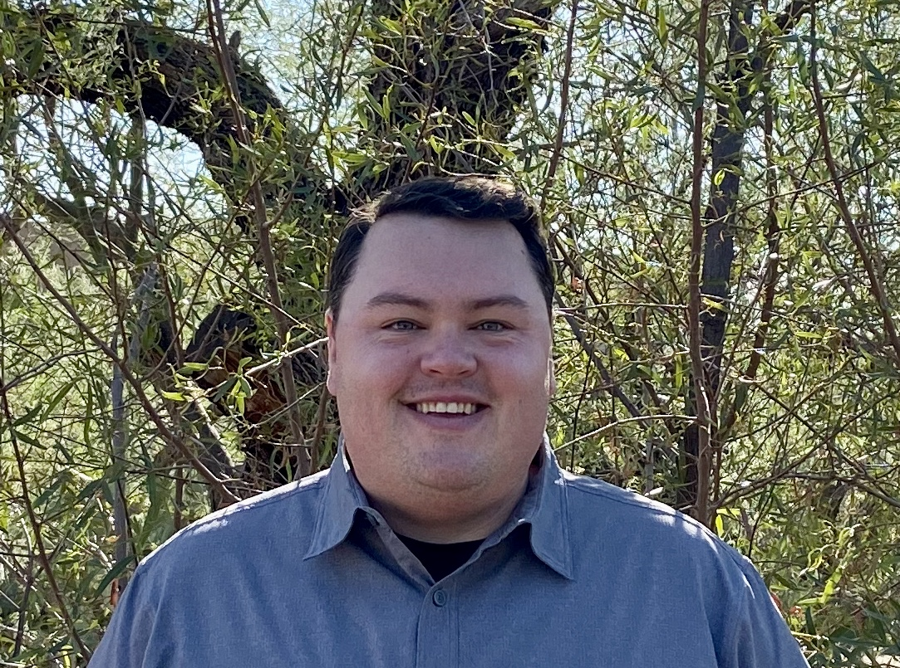

# Capstone 1 - CyVerse FOSS 2021

In Capstone I, we will be working to share data management plans with each other using the website materials. Ultimately, we will make a page for our team describing team members, link to the person’s data management plan, etc.

## Team Members

<h3 style="text-align:center;color:Green;">Austin Rutherford</h3>

    
   

Austin is originally from Georgia and completed his undergraduate work at Indiana University. Before coming to the University of Arizona, he interned for the Bureau of Land Management in Nevada and was a technician for the US Geological Survey in Utah. He is currently a PhD Candidate within the School of Natural Resources and the Environment in the Ecology, Management, and Restoration of Rangelands program. His dissertation work utilizes field-based experiments to investigate the seedling establishment phase of velvet mesquite shrubs in Sonoran Desert grasslands. His finding directly contribute to the improvement of the precipitatio products that is important not only for the present weather observations but also for long-term climate analysis, either by itself or through its contribution to the climate products. 

Find more information about Austin's projects at the **[Archer Lab Website](https://cals.arizona.edu/research/archer/exotic.html)**

He is slowly but surely creating a new Data Management Plan (DMP) for an existing project using the [Data Steward Wizard](https://ds-wizard.org/).
The [DMPTool](https://dmptool.org) was used originally for the project proposal, but Austin is testing the feature differences between the two tools.

An early draft version of a test DMP using the Data Steward Wizard can be found **[HERE](https://researchers.ds-wizard.org/projects/64a7d204-a248-41de-b481-8da4d557f372).**

---

### Kangsan
I am a second year phd student in the school of geography. One of my interesting area is wildfire, mainly focusing on forest restoration after fires. I prefer using LiDAR and Landsat-derived fire severity dataset. Interesting study area is Southwestern U.S. around Arizona and New Mexico. I am wondering whether we can visualize fire severity datset on the web through this capstone project.

### Ariyan
Ariyan is a 3rd year PhD student in the department of Computer Science at the University of Arizona. He previously received his B.Sc. in Computer Science from Shahid Beheshti University in Tehran, Iran. He is interested in the applications of Deep Learning and Image Processing in the Medical and Plant Sciences. Ariyan is currently working on the PhytoOracle project and is designing machine learning, computer vision, and statistical models for geo-correction and stitching of high-resolution RGB image data.

<h3 style="text-align:center;color:Green;">Reza Ehsani</h3>

    
   

Reza is a 2-nd year PhD candidate in Hydrology & Atmospheric Sciences at the University of Arizona with BSc in Civil & Environmental Engineering. Before joining UArizona, he was involved in several World Bank Group projects in Tanzania as a water resources expert. His dissertation work is focused on precipitation retrieval in high latitudes
and cold regions utilizing machine learning & deep learning. His works directly contribute to the improvement of the precipitation products such as NASA GPM IMERG that is important not only for the present weather observations but also for long-term climate analysis, either by itself or through its contribution to the climate products.

You can contact Reza at **[LinkedIn.com/in/rehsani/](https://www.linkedin.com/in/rehsani/)**

Reza is working to create a new Data Management Plan (DMP) using the [Data Steward Wizard](https://ds-wizard.org/).

#### To-dos?
Add headshots and connect DMPs.
